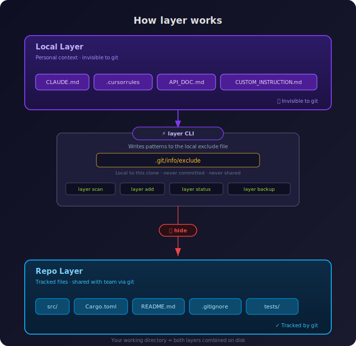

# layer — Context layers for git & agentic coding workflows

A fast CLI to manage local-only context files using Git’s `.git/info/exclude`.

`layer` keeps your personal AI context (Claude instructions, Cursor rules, Aider configs, project notes) out of git without touching `.gitignore`.

## Why

If you use AI coding tools, you accumulate context files like `CLAUDE.md`, `.cursorrules`, `.aider.conf.yml`, and custom markdown docs per project. These are personal to your workflow — teammates don't need them, and they shouldn't clutter the repo's `.gitignore`.

Git already has a mechanism for this: `.git/info/exclude`. But managing it manually (finding the file, editing it, remembering the syntax) is tedious. `layer` automates the entire workflow.

Since `.git/info/exclude` is local to each clone, it disappears if you delete the repo and re-clone. `layer backup` saves your entries to `~/.layer-backups/`, and `layer restore` brings them back in seconds.

## Concept



layer treats local context as a layer on top of your repository:

- Repo layer — tracked files
- Local layer — personal context hidden via `.git/info/exclude`

This keeps personal AI context separate from the project itself.

## Install

```bash
cargo install git-layer
```

## Quick start

```bash
# Discover and layer local AI context files
layer scan

# Or add files directly
layer add CLAUDE.md .claude/ .cursorrules

# Check your dashboard
layer status
```

## Commands

### Core

| Command                | Description                                                               |
| ---------------------- | ------------------------------------------------------------------------- |
| `layer add [files...]` | Add files or patterns to your local layer (interactive picker if no args) |
| `layer rm [files...]`  | Remove layered entries (interactive if no args)                           |
| `layer ls`             | List all layered entries with status                                      |
| `layer scan`           | Auto-detect context files and layer them                                  |
| `layer status`         | Dashboard — layered, exposed, and discovered files                        |

### Diagnostics

| Command               | Description                                                |
| --------------------- | ---------------------------------------------------------- |
| `layer doctor`        | Health check — finds exposed, stale, and redundant entries |
| `layer why <file>`    | Explain why a file is or isn't ignored by git              |
| `layer why <file> -v` | Same, with git ignore precedence explanation               |
| `layer patterns`      | List all auto-detected file patterns                       |

### Maintenance

| Command                 | Description                                                     |
| ----------------------- | --------------------------------------------------------------- |
| `layer clean`           | Remove stale entries (files that no longer exist)               |
| `layer clean --all`     | Also clean stale entries you added manually to the exclude file |
| `layer clean --dry-run` | Preview what would be removed                                   |
| `layer clear`           | Remove all layered entries (with confirmation)                  |
| `layer edit`            | Open `.git/info/exclude` in your `$EDITOR`                      |

### Safety

| Command                | Description                                             |
| ---------------------- | ------------------------------------------------------- |
| `layer backup`         | Snapshot current layered entries to `~/.layer-backups/` |
| `layer restore`        | Restore from a backup (interactive)                     |
| `layer restore --list` | List available backups                                  |

### Global

| Command                       | Description                                                  |
| ----------------------------- | ------------------------------------------------------------ |
| `layer global add <files...>` | Add entries to `~/.config/git/ignore` (applies to all repos) |
| `layer global ls`             | List all global gitignore entries (managed + external)       |
| `layer global rm [files...]`  | Remove global gitignore entries (interactive if no args)     |

## Terminology

layer uses consistent terms across all commands:

- **Layered** — file is in `.git/info/exclude` and hidden from git
- **Exposed** — file is excluded but still tracked by git (needs `git rm --cached`)
- **Discovered** — known context file found on disk that isn't layered yet
- **Stale** — layered entry that no longer matches any file on disk

## Auto-detected AI context files

`layer scan` and `layer status` automatically detect these files:

| Tool               | Files                                                                                            |
| ------------------ | ------------------------------------------------------------------------------------------------ |
| Claude Code        | `CLAUDE.md`, `.claude/`, `.claude.json`, `Agents.md`                                             |
| OpenAI Codex       | `AGENTS.md`                                                                                      |
| Cursor / PearAI    | `.cursorrules`, `.cursor/`, `.cursorignore`, `.pearai/`                                          |
| Windsurf           | `.windsurfrules`, `.windsurf/`                                                                   |
| Aider              | `.aider*`, `.aider.conf.yml`, `.aiderignore`                                                     |
| Cline / Roo Code   | `.clinerules`, `.cline/`, `.roocodes/`, `.roocoderules`                                          |
| GitHub Copilot     | `.github/copilot-instructions.md`, `.github/copilot-custom-instructions.md`                      |
| Continue / Void    | `.continue/`, `.void/`                                                                           |
| Generic AI Context | `agents.md`, `AI.md`, `AI_CONTEXT.md`, `CONTEXT.md`, `INSTRUCTIONS.md`, `PROMPT.md`, `SYSTEM.md` |

You can always add any file manually with `layer add <file>`.

## How it works

Git checks ignore rules in this order:

1. `.git/info/exclude` — local to this clone, never shared **(this is what layer manages)**
2. `.gitignore` — tracked and shared with the team
3. `~/.config/git/ignore` — global, applies to all repos

A file must be **untracked** for any ignore rule to take effect. If a file is already tracked, layering it will mark it as "exposed" and tell you exactly how to fix it.

## Development

```bash
cargo check
cargo test
cargo clippy
cargo build --release
```

## Changelog

### v0.1.3

- **Tree picker for `layer add`** — interactive mode now shows a collapsible tree instead of a flat list. Directories are collapsed by default; use `←/→` to expand/collapse at any nesting depth.
- **Nested directory grouping** — sub-directories are independently expandable. Single-file directories are promoted to the parent level.
- **Exposed file details** — `layer status` and `layer ls` now show which specific files are tracked inside a directory entry.

## License

MIT
